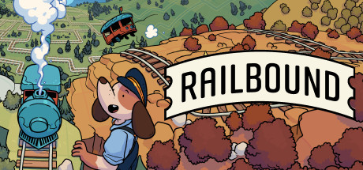

# Railbound Constraint Programming Solver

This project provides a robust solver for the delightful puzzle game [Railbound](https://afterburn.games/railbound/), built using the power of **Constraint Programming** with [MiniZinc](https://www.minizinc.org/). It can automatically find valid track layouts for even the most complex puzzles.

## About The Project

Railbound's gameplay, which involves laying a limited number of tracks to connect train cars to a locomotive, is a natural fit for a Constraint Satisfaction Problem (CSP). This solver models the game's rules, mechanics, and objectives as a set of mathematical constraints. A MiniZinc solver then explores the vast space of possible track layouts to find a working solution.

This repository is a comprehensive resource for anyone interested in constraint programming, puzzle solving, or the technical details of Railbound's mechanics.

## Game Features Supported

### Core Mechanics

- **Track Placement**: Laying tracks with limited resources to connect trains to the target
- **Train Movement**: Multi-train pathfinding with collision avoidance and sequential arrival
- **Track Types**: Straights, corners, switches (deterministic, dynamic, exit-triggered), and tunnels

### Advanced Features

- **Gates**: Timed obstacles that open/close based on activation triggers
- **Dynamic Switches**: Switches that toggle state each time a train passes through
- **Tunnels**: Teleportation points allowing trains to move between distant locations
- **Stations**: Designated stops where trains must wait before continuing to the target

### Station Mechanics

- **Station Assignment**: Each station is assigned to a specific train via `(row, col, train_id)` format
- **Multiple Stations**: A train can have multiple stations assigned to it (same train_id)
- **Wait Time**: When a train first arrives at any assigned station, it must wait for **2 timesteps**
- **First Visit Only**: Subsequent visits to the same station require no waiting
- **Mandatory Visit**: Trains must visit **ALL** of their assigned stations before reaching the target
