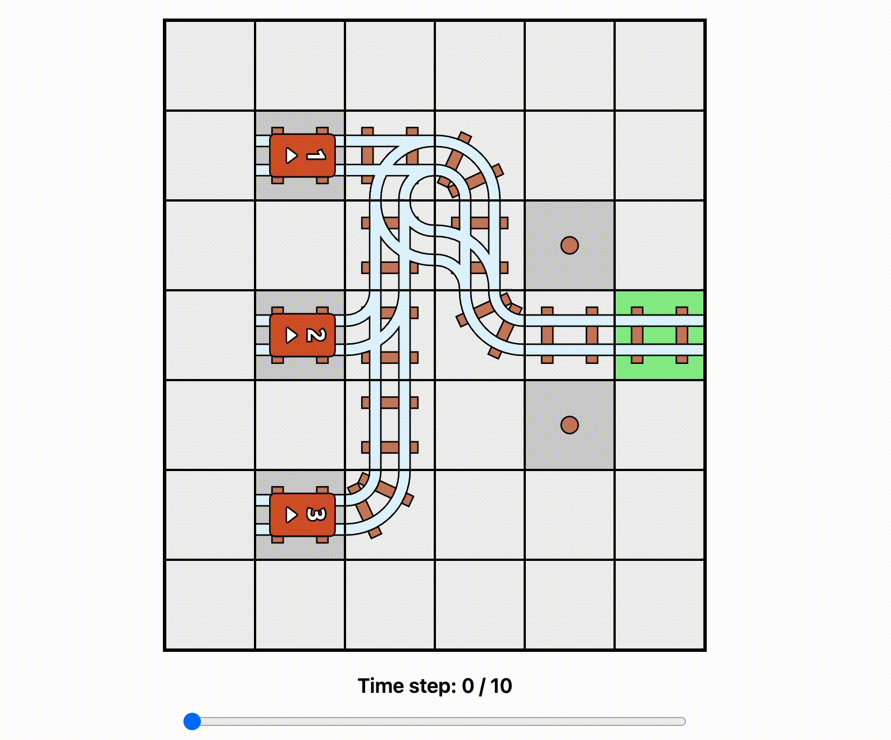

# Railbound Constraint Programming Solver


This repository contains a MiniZinc-based solver for the puzzle game [Railbound](https://afterburn.games/railbound/). It treats each puzzle as a constraint satisfaction problem: every piece of track, switch, or gate is represented as a decision variable, and the solver searches the space of legal assignments to produce a valid route for each train. The goal of the project is to capture the full set of mechanics found in the main campaign while keeping the model readable for people learning constraint programming.

## Solver Coverage

- 12 main-line levels are tracked in this project.
- Levels 1–8 are currently solved automatically; levels 9–12 are work in progress.
- Instances for solved levels live in `data/levels/` as ready-to-run MiniZinc data files.


### Level Feature Map

| Level | Key Mechanics                               | Solver Status |
| ----- | ------------------------------------------- | ------------- |
| 1     | Straights, curves, basic switches           | ✅ solved     |
| 2     | Tunnels                                     | ✅ solved     |
| 3     | Activation tiles, timed gates               | ✅ solved     |
| 4     | Dynamic switches (`DSWITCH`)                | ✅ solved     |
| 5     | Stations with enforced dwell times          | ✅ solved     |
| 6     | Exit-triggered switches (`ESWITCH`)         | ✅ solved     |
| 7     | Decoy cars that must be delayed or rerouted | ✅ solved     |
| 8     | Large-grid search stress test               | ✅ solved     |
| 9     | Semaphores (three-way stop tile)            | ⏳ modeling   |
| 10    | Semaphores (three-way stop tile)            | ⏳ modeling   |
| 11    | Two target locations (dual goals)           | ⏳ modeling   |
| 12    | Two target locations (dual goals)           | ⏳ modeling   |

## Mechanics Modeled

**Track placement** – Straights, curves, and switches are modeled with finite-domain variables that encode both geometry and orientation. Capacity constraints ensure no two trains attempt to occupy the same segment simultaneously.

**Train movement** – A discrete time horizon tracks every train. Sequential arrival rules are enforced by ordering constraints so that cars couple with the locomotive in the intended order.

**Switch logic** – Deterministic, dynamic (`DSWITCH`), and exit-triggered (`ESWITCH`) switches toggle based on train visits. Auxiliary Boolean variables encode state transitions and prevent impossible diverge/converge sequences.

**Gates and activators** – Gates listen to activation tiles that flip after a train crosses them. Timing constraints ensure a gate is open when a train reaches it and closed otherwise.

**Stations** – Stations are indexed as `(row, col, train_id)`. Each train must visit all assigned stations before termination and incurs a two-step dwell time the first time it arrives at any of its stations.

**Tunnels** – Paired entrance-exit cells are linked with equality constraints so that entering at `(r₁, c₁)` instantly re-emerges at `(r₂, c₂)` on the same time step.

**Decoys** – Decoy trains are modeled similarly to real cars but are exempt from the completion order, allowing them to circulate or park without interfering with the main objective.

**Semaphores** – Player-placeable gates that sit on straights or corners adjacent to switches. They start closed, blocking traffic from either side, and automatically flip open forever one timestep after any train (or decoy) enters a connected switch that feeds the guarded track.

**Dual targets** – Some levels require trains to reach two distinct destination locations. Feasibility requires satisfying both targets; the model enforces completion only when all assigned trains have visited both goal tiles in the required order (if any).

## Repository Layout

- `main.mzn` – Core MiniZinc model encoding the Railbound mechanics and objective.
- `formatting.mzn` – Helper predicates for consistent board rendering when visualizing solutions.
- `lib/` – Modular MiniZinc includes for movement rules, piece encodings, and shared constraints.
- `data/` – MiniZinc `.dzn` instances for each campaign puzzle currently modeled.
- `images/` – Static artwork shipped with the project (used in documentation).
- `docs/` – Reference assets such as the cover image and gameplay animation embedded above.
- `viz.html` – Lightweight viewer that turns solver output into an interactive grid.
- `benchmark_results/` – Historical solver timing logs for different configurations.
- `run_benchmarks.sh` – Convenience script to execute timed solver runs across multiple levels.
- `project.mzp` – MiniZinc project file capturing IDE configuration for this workspace.

## Installation

1. Install the latest [MiniZinc bundle](https://www.minizinc.org/software.html). It ships with the command-line tools, MiniZinc IDE, and the OR-Tools solver used in this project.
2. Clone the repository and ensure the `minizinc` executable is on your `PATH`.
   ```bash
   git clone https://github.com/your-user/railbound_cp.git
   cd railbound_cp
   ```

## Running The Solver

If you're crafting your own `.dzn` instances, see the data schema in [docs/data_format.md](docs/data_format.md).

**CLI**

- Choose a data file from `data/` (for example `data/8/8-1.dzn`).
- Run MiniZinc with your preferred backend:
  ```bash
  minizinc --solver or-tools main.mzn data/8/8-1.dzn
  ```
- Review the textual solution output or post-process it with the tooling in `viz.html`.

**MiniZinc IDE**

- Launch the MiniZinc IDE and open `project.mzp`.
- Select a solver configuration (OR-Tools works well) and click _Run_.
- Press Run and choose a data file when prompted.



Solver performance depends on the level size: levels 1–7 typically solve in under a second, while level 8 requires broader search and may take up to a minute on laptop hardware.

## Contributing

Open an issue or discussion thread if you spot a mechanic that is not yet captured. Pull requests that improve the MiniZinc model, add tests, or document the remaining four levels are welcome.

## Similar Work

[FoxtrotOnce/RailboundSolver](https://github.com/FoxtrotOnce/RailboundSolver) is a logic-driven solver that aims to compute optimal Railbound layouts and is currently being integrated into a public website frontend. Its documentation includes a detailed program flowchart, and many of the visuals in this project appear courtesy of [FoxtrotOnce](https://github.com/FoxtrotOnce).
