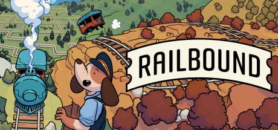

# Railbound Constraint Programming Solver



A constraint programming solver for [Railbound](https://afterburn.games/railbound/) puzzles using [MiniZinc](https://www.minizinc.org/).

## About Railbound

Railbound is a comfy track-building puzzle game created by Afterburn. Players must place track pieces on a grid to guide trains to their destination without collisions. The game features charming aesthetics and increasingly complex puzzles involving switches, corners, and tunnels.

Learn more:

- Official website: https://afterburn.games/railbound/
- Wikipedia: https://en.wikipedia.org/wiki/Railbound

## About This Project

This project models Railbound puzzles as Constraint Satisfaction Problems (CSP) and solves them using MiniZinc, a high-level constraint modeling language. The solver can automatically find valid track layouts that guide all trains to their target destination in the correct order while respecting collision avoidance and track budget constraints.

## Features

- **Complete puzzle modeling**: Supports all core Railbound mechanics

  - Straight tracks and corners
  - Switches (3-way junctions)
  - Dynamic switches (DSWITCHes) - reconfigurable switches that toggle when activated
  - Tunnels (teleportation between paired locations with directional entry restrictions)
  - Gates and activations (blocking mechanisms with trigger-based toggling)
  - Multiple trains with sequential arrival requirements
  - Collision avoidance (no train-to-train collisions or position swaps)
  - Track budget constraints
  - Pre-placed pieces

- **Optimization**: Prefers simpler solutions

  - Cost-based optimization minimizes puzzle complexity
  - Automatically prefers straight tracks over switches when both work
  - Produces cleaner, more elegant solutions

- **Flexible input format**: Easy-to-write `.dzn` data files for puzzle definitions
- **Automatic solving**: Finds optimal solutions or proves unsatisfiability
- **Visual output**: Displays grid layout, piece costs, and train paths
- **Multiple solvers**: Supports Gecode, Chuffed, and other MiniZinc solvers
- **Well-documented code**: Clean, readable implementation with clear section organization

## Requirements

- [MiniZinc](https://www.minizinc.org/software.html) (version 2.5+)
- A MiniZinc solver:
  - **Gecode** (recommended for most puzzles) - Fast and reliable
  - **Chuffed** - Good for complex puzzles (default in project file)
  - **OR-Tools** - Alternative option
- **PowerShell** (optional, for running the batch test script)
- **MiniZinc IDE** (optional, can open `project.mzp` for integrated development)

## Installation

1. Install MiniZinc from https://www.minizinc.org/software.html
2. Clone this repository:
   ```bash
   git clone <repository-url>
   cd railbound_cp
   ```

## Usage

Run the solver on a puzzle:

```bash
minizinc --solver Gecode railbound.mzn test/2-1.dzn
```

Or use Chuffed for more complex puzzles:

```bash
minizinc --solver Chuffed railbound.mzn test/2-8.dzn
```

With a time limit (in milliseconds):

```bash
minizinc --solver Gecode railbound.mzn test/2-8.dzn --time-limit 60000
```

### Output

The solver produces:

```
============================================================
SOLUTION FOUND
============================================================

GRID LAYOUT:
[|       EMPTY,       EMPTY,       EMPTY, TUNNEL_R, STRAIGHT_RL, STRAIGHT_RL, STRAIGHT_RL
 |       EMPTY,       EMPTY,       EMPTY,    EMPTY,       EMPTY,       EMPTY,       EMPTY
 |       EMPTY,       EMPTY,       EMPTY,    EMPTY,       EMPTY,       EMPTY,       EMPTY
 | STRAIGHT_RL, STRAIGHT_RL, STRAIGHT_RL, TUNNEL_L,       EMPTY,       EMPTY,       EMPTY
 |]

Total piece cost: 6 (straights=1, corners=2, switches=3)
Latest arrival time: 6
TRAIN PATHS:
Train 1: arrival at time 6
  Path: [(4, 1), (4, 2), (4, 3), (4, 4), (1, 5), (1, 6), (1, 7)]
```

The **total piece cost** shows how simple the solution is - lower is better!

## Puzzle Format

Puzzles are defined in `.dzn` (MiniZinc data) files. Here's an example:

```minizinc
W=6;                    % Grid width
H=3;                    % Grid height

MAX_TIME=W*H;           % Maximum time steps
MAX_TRACKS=10;          % Track budget

TARGET_R=1;             % Target row
TARGET_C=6;             % Target column

N_TRAINS=1;             % Number of trains
TRAINS=[(3,1,TOP)];     % Train starting positions: (row, col, initial_direction)

N_INIT_POS=8;           % Number of pre-placed pieces
INIT_POS=[
  (3,1,STRAIGHT_TD),    % Pre-placed pieces: (row, col, piece_type)
  (1,6,STRAIGHT_RL),
  % ... more pieces
];

N_TUNNELS=0;            % Number of tunnel pairs
TUNNEL_PAIRS=[];        % Tunnel definitions: (row1,col1,dir1,row2,col2,dir2)

N_GATES=0;              % Number of gates
GATES=[];               % Gate definitions: (row,col,gate_id,initially_open)

N_ACTIVATIONS=0;        % Number of activations
ACTIVATIONS=[];         % Activation definitions: (row,col,gate_id)

N_DSWITCHES=0;          % Number of dynamic switches
DSWITCHES=[];           % DSwitch definitions: (row,col,dswitch_id)
```

### Parameters

- **W, H**: Grid dimensions (columns × rows)
- **MAX_TIME**: Maximum number of time steps for simulation
- **MAX_TRACKS**: Maximum number of non-EMPTY track pieces that can be placed (excluding pre-placed pieces)
- **TARGET_R, TARGET_C**: The destination cell all trains must reach
- **TRAINS**: Array of train starting positions as tuples `(row, col, direction)`
  - Directions: `TOP`, `RIGHT`, `DOWN`, `LEFT`
- **INIT_POS**: Pre-placed pieces on the grid as tuples `(row, col, piece_type)`
- **TUNNEL_PAIRS**: Paired tunnel endpoints as tuples `(row_A, col_A, dir_A, row_B, col_B, dir_B)`
- **GATES**: Gate positions as tuples `(row, col, gate_id, initially_open)`
  - `gate_id`: Integer identifier linking gates to activations
  - `initially_open`: `true` if gate starts open, `false` if closed
- **ACTIVATIONS**: Activation trigger positions as tuples `(row, col, gate_id)`
  - When a train enters an activation cell, all gates with matching `gate_id` toggle
- **DSWITCHES**: Dynamic switch positions as tuples `(row, col, dswitch_id)`
  - `dswitch_id`: Integer identifier linking DSWITCHes to activations
  - When a train triggers an activation with matching `dswitch_id`, all linked DSWITCHes toggle their routing
  - DSWITCHes must be pre-placed via `INIT_POS`
  - All DSWITCHes start in normal (non-swapped) state

### Track Pieces

- **EMPTY**: No track
- **STRAIGHT_TD**: Vertical straight track (│) - connects TOP↔DOWN
- **STRAIGHT_RL**: Horizontal straight track (─) - connects RIGHT↔LEFT
- **CORNER_TR**: Corner connecting TOP↔RIGHT (└)
- **CORNER_TL**: Corner connecting TOP↔LEFT (┘)
- **CORNER_DR**: Corner connecting DOWN↔RIGHT (┌)
- **CORNER_DL**: Corner connecting DOWN↔LEFT (┐)
- **SWITCH\_\***: 3-way switches with naming pattern `SWITCH_<Single>_<Straight>_<Curve>`
  - Example: `SWITCH_T_D_R` connects TOP→DOWN (straight), DOWN→RIGHT (curve), RIGHT→DOWN
  - Example: `SWITCH_D_T_L` connects DOWN→TOP (straight), TOP→LEFT (curve), LEFT→TOP
- **DSWITCH\_\***: Dynamic 3-way switches that can reconfigure when activated
  - Same naming pattern as SWITCH: `DSWITCH_<Single>_<Straight>_<Curve>`
  - **Normal state**: Behaves like corresponding SWITCH piece
  - **After activation**: Single and Straight connections swap (Curve unchanged)
  - Example: `DSWITCH_L_R_D` initially routes LEFT→RIGHT, RIGHT→DOWN, DOWN→RIGHT
  - After activation: RIGHT→LEFT, LEFT→DOWN, DOWN→LEFT (Single↔Straight swapped)
  - All DSWITCHes with the same `dswitch_id` toggle together when linked activation is triggered
  - **Pre-placed only**: DSWITCHes must be placed via `INIT_POS`, not freely by solver
  - **Zero cost**: DSWITCHes have no cost impact (like tunnels)
- **TUNNEL\_\***: Tunnel entrances with **directional entry restrictions**
  - `TUNNEL_T`: Can only be entered from TOP, paired tunnel exits in TOP direction
  - `TUNNEL_R`: Can only be entered from RIGHT, paired tunnel exits in RIGHT direction
  - `TUNNEL_D`: Can only be entered from DOWN, paired tunnel exits in DOWN direction
  - `TUNNEL_L`: Can only be entered from LEFT, paired tunnel exits in LEFT direction
  - Tunnels work bidirectionally - either endpoint can be the entry point
  - When a train enters a tunnel, it teleports to the paired tunnel and exits in the specified direction

### Gates and Activations

- **Gates**: Blocking mechanisms that prevent train movement
  - Placed on track pieces (straights, corners, or switches)
  - States: OPEN (trains can pass) or CLOSED (trains cannot enter)
  - Each gate has a `gate_id` that links it to activations
  - Multiple gates can share the same ID (they toggle together)
- **Activations**: Trigger points that toggle gate states
  - When a train enters an activation cell at time `t`, all gates with matching `gate_id` toggle at time `t+1`
  - OPEN gates become CLOSED, CLOSED gates become OPEN
  - Activations can be triggered multiple times
  - Trains blocked by closed gates will wait in place until the gate opens

**Example:**

```minizinc
N_GATES=1;
GATES=[(1,2,1,false)];        % Gate at (1,2), ID=1, starts CLOSED

N_ACTIVATIONS=1;
ACTIVATIONS=[(2,4,1)];        % Activation at (2,4) triggers gate ID=1
```

### Dynamic Switches (DSWITCHes)

- **DSWITCHes**: Dynamic 3-way switches that reconfigure when activated
  - Work like regular switches but can swap their Single and Straight connections
  - Each DSWITCH has a `dswitch_id` that links it to activations
  - Multiple DSWITCHes can share the same ID (they toggle together)
  - All DSWITCHes start in normal (non-swapped) state
  - When a train triggers a linked activation, DSWITCHes toggle between normal and swapped states
  - Must be pre-placed via `INIT_POS` (cannot be freely placed by solver)

**Routing behavior:**
- **Normal state**: Routes like the corresponding SWITCH piece
  - Example: `DSWITCH_L_R_D` routes LEFT→RIGHT, RIGHT→DOWN, DOWN→RIGHT
- **Swapped state**: Single and Straight connections swap (Curve unchanged)
  - Example: `DSWITCH_L_R_D` swapped routes RIGHT→LEFT, LEFT→DOWN, DOWN→LEFT

**Example:**

```minizinc
N_INIT_POS=1;
INIT_POS=[(1,3,DSWITCH_L_R_D)];  % Pre-place DSWITCH at (1,3)

N_ACTIVATIONS=1;
ACTIVATIONS=[(1,2,1)];           % Activation at (1,2) with ID=1

N_DSWITCHES=1;
DSWITCHES=[(1,3,1)];             % DSWITCH at (1,3) toggles when activation ID=1 is triggered
```

When a train passes through cell (1,2), it triggers the activation, causing the DSWITCH at (1,3) to swap its routing for all subsequent trains.


## Example Puzzles

The `test/` directory contains 28 example puzzles from different worlds:

### World 1 Puzzles (9 puzzles)

- `1-3.dzn`: Single train with switches
- `1-9.dzn`: Two trains requiring coordination
- `1-11A.dzn`, `1-11B.dzn`: Three trains with complex routing
- `1-12.dzn`, `1-12A.dzn`: Multi-train coordination
- `1-13.dzn`, `1-13A.dzn`: Advanced routing
- `1-14A.dzn`, `1-15A.dzn`: Complex multi-train puzzles

### World 2 Puzzles (7 puzzles)

- `2-1.dzn`: Simple puzzle demonstrating cost optimization
- `2-3.dzn`, `2-3B.dzn`: Coordination puzzles
- `2-5A.dzn`, `2-5B.dzn`: Switch-heavy puzzles
- `2-8.dzn`: Three trains with tunnel teleportation
- `2-9.dzn`: Advanced tunnel usage

### World 3 Puzzles (10 puzzles)

- `3-1.dzn`: Basic gate and activation puzzle
- `3-2.dzn`: Single gate coordination between trains
- `3-3A.dzn`: Complex gate coordination
- `3-6.dzn`, `3-7.dzn`, `3-8.dzn`: Advanced gate puzzles
- `3-10C.dzn`: Challenging puzzle (may require longer solve time)
- `3-11.dzn`, `3-11B.dzn`: Complex multi-gate scenarios

### World 8 Puzzles (2 puzzles)

- `8-1.dzn`, `8-2.dzn`: Advanced challenge puzzles

### Running Multiple Tests

#### Using the PowerShell Test Runner (Recommended)

The project includes a comprehensive test runner script that runs all puzzles and collects statistics:

```powershell
.\run_all_tests.ps1
```

This script:

- Runs all test files in the `test/` directory
- Uses the Chuffed solver by default
- Collects detailed statistics (solve time, nodes, failures, variables, etc.)
- Saves output to the `results/` directory
- Generates a summary CSV file with all statistics
- Color-coded output for easy reading

#### Manual Batch Testing

Test several puzzles at once:

```bash
# PowerShell
Get-ChildItem test\*.dzn | ForEach-Object {
  Write-Host "Solving $_..."
  minizinc --solver Gecode railbound.mzn $_.FullName
}

# Bash
for f in test/*.dzn; do
  echo "Solving $f..."
  minizinc --solver Gecode railbound.mzn "$f"
done
```

## How It Works

The solver uses constraint programming with optimization to model the puzzle:

### 1. **Variables**

- **Grid variables**: Each cell can contain any track piece
- **Train state variables**: Position and direction for each train at each time step
- **Arrival times**: When each train reaches the target

### 2. **Constraints**

- Trains start at specified positions with initial exit directions
- Train movement follows track piece routing rules (straights, corners, switches)
- Tunnel teleportation with directional entry restrictions
- Gate blocking and train waiting when gates are closed
- Gate toggling when trains trigger activations
- Trains must reach the target in sequential order (no overtaking)
- No collisions between trains (same cell or position swaps)
- Connectivity validation for corners and switches (all entry points must connect)
- Respect the track budget (maximum number of placeable pieces)
- Honor pre-placed pieces, tunnel placements, gates, and activations

### 3. **Optimization**

The solver minimizes the total piece cost to prefer simpler solutions:

- **Straight pieces**: cost = 1 (simplest)
- **Corner pieces**: cost = 2
- **Switch pieces**: cost = 3 (most complex)
- **Empty/Tunnel pieces**: cost = 0 (fixed)

This ensures the solver finds the cleanest, most elegant solution rather than arbitrary complex arrangements.

### Key Implementation Details

- **Tunnel Logic**: Tunnels enforce one-way entry restrictions. When a train enters a tunnel, it instantly appears at the next cell after the paired tunnel, exiting in the paired tunnel's direction.
- **Gate Blocking**: Trains cannot enter cells with closed gates and will wait in place. When an activation is triggered at time `t`, gates toggle at time `t+1`, allowing blocked trains to proceed.
- **Switch Routing**: Switches have three connections with specific routing rules based on which direction the train enters.
- **Collision Avoidance**: Both same-cell occupancy and position-swap collisions are prevented (except at the target cell).
- **Sequential Arrival**: Trains must arrive at the target in order - later trains cannot reach the target before earlier trains.
- **Connectivity Enforcement**: All entry points of corners and switches must connect to valid adjacent cells, preventing switches at boundaries where simpler pieces would work.

## Project Structure

```
railbound_cp/
├── railbound.mzn           # Main MiniZinc model (well-documented and refactored)
├── viz.html                # Interactive visualization for puzzle solutions
├── project.mzp             # MiniZinc IDE project file
├── run_all_tests.ps1       # PowerShell script to run all tests with statistics
├── cheatsheet.mzn          # Quick reference for MiniZinc syntax
├── cover.jpg               # Cover image
├── test/                   # Example puzzle data files (28 puzzles)
│   ├── 1-*.dzn            # World 1 puzzles (9 files)
│   ├── 2-*.dzn            # World 2 puzzles (7 files)
│   ├── 3-*.dzn            # World 3 puzzles (10 files)
│   ├── 8-*.dzn            # World 8 puzzles (2 files)
│   └── ...
├── results/                # Test output directory (gitignored)
│   └── test_results.csv   # Summary of test runs
└── README.md               # This file
```

## Documentation

- **README.md**: Main documentation (this file)
- **viz.html**: Interactive visualization that displays gates (colored circles) and activations (orange squares)
- **railbound.mzn**: Extensively commented model with inline documentation

## Code Quality

The `railbound.mzn` model features:

- ✅ Clean, well-organized structure with clear section headers
- ✅ Comprehensive inline documentation
- ✅ Logical grouping of related components
- ✅ Helper predicates and constants for readability
- ✅ Cost optimization for elegant solutions
- ✅ Tested with multiple solvers (Gecode, Chuffed)

## Contributing

Feel free to add more puzzle definitions or improve the model!

### Adding New Puzzles

1. Create a new `.dzn` file in the `test/` directory
2. Define the grid size, trains, and constraints
3. Test with: `minizinc --solver Gecode railbound.mzn test/your-puzzle.dzn`

### Improving the Model

The code is well-documented and refactored for readability. Key sections include:

- Parameter definitions
- Type definitions and track piece enums
- Helper constants and lookup tables
- Decision variables
- Constraints (movement, collision, gates, etc.)
- Optimization objective

## License

This is an educational project for learning constraint programming. Railbound is a trademark of Afterburn.

## Acknowledgments

- Puzzle game design: [Afterburn](https://afterburn.games/)
- Constraint modeling: [MiniZinc](https://www.minizinc.org/)
